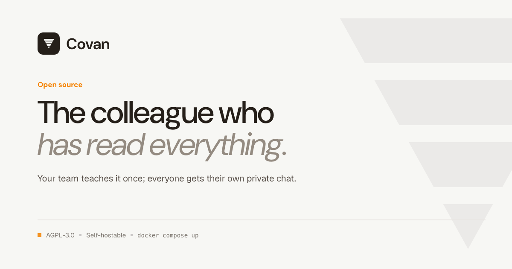
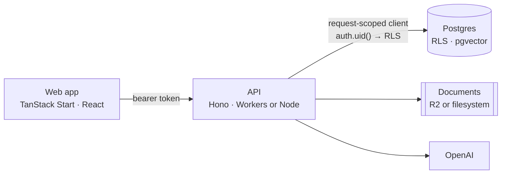

# Covan

A shared AI agent for your team. Everyone trains it together; everyone talks to
it privately.



Half a minute, uncut: start from a template, let the persona write itself from
the name, and the agent is live in a chat that belongs to you alone.

https://github.com/user-attachments/assets/450d63e3-9172-4b58-a20a-12d1da616a70

## What is Covan?

Most team AI tools are built for engineers: a Slack bot, a sandbox, a
deployment pipeline. Covan is built for the rest of the company.

Your team uploads what it knows — process docs, contracts, research — and that
becomes one agent's memory. Everyone talks to that agent in their own private
session, so the designer's questions and the finance lead's questions never mix.

Give it a persona ("you are our senior product manager") and it answers like
one.

## Features

- **Shared brain, private rooms.** One agent, trained collectively; every
  conversation isolated per person by Postgres row level security, not by a
  check in the API.
- **Knowledge bundles.** Group documents by subject and attach or detach them
  from an agent, instead of one undifferentiated pile.
- **Grounded answers.** Retrieval over your documents — `pgvector`, with a
  similarity floor so an off-topic question doesn't drag in the nearest
  irrelevant passage — and the documents that grounded a reply are stored with
  it, so citations survive a reload.
- **Routines.** Scheduled work that runs while nobody is watching: point one at
  an RSS feed or a page, say what to do with it, and get the result by email or
  Slack.
- **Collaborative sessions.** Bring the team into one conversation, or one
  brainstorm board, when the question is shared.
- **Two runtimes, one source.** The same code runs on Cloudflare Workers with R2
  in production and on Node with the filesystem under `docker compose`.

### How this differs from `qm`

[`yc-software/qm`](https://github.com/yc-software/qm) (MIT) is the obvious
alternative and a good project. It describes itself as a multiplayer agent
*harness* for work: an isolated agent workspace per employee, shared channels
and projects, Slack and web, and a pluggable choice of model. If your team is
mostly engineers, that is very likely what you want, and it is better to say so
than to pretend the comparison isn't there.

Covan is not a harness. It is one agent that knows what your team wrote down,
and a small surface around it — upload, ask, schedule. The bet is that a
five-person agency, a clinic, or a finance team does not want to operate agent
infrastructure; it wants a colleague who has read everything. That is why the
whole product is one `docker compose up` and one API key, and why the only
interface is a web app: there is no CLI, and nobody has to be the person who
runs it.

### Status

Covan runs, and it was extracted from a working private product rather than
written as a demo. It is nonetheless young as an open-source project: there are
no published images or releases yet, so upgrading means pulling the repository
and rebuilding, the API is unversioned, and nothing is promised about
compatibility between commits. Read
[`docs/self-hosting.md`](docs/self-hosting.md) before you put it in front of
anyone outside your team.

## Quick start

No accounts, no cloud setup. You need Docker and an OpenAI API key.

```bash
git clone https://github.com/covan-ai/covan
cd covan
cp .env.docker.example .env     # set OPENAI_API_KEY
docker compose up
```

The first run builds two images and pulls half a dozen more, so give it a few
minutes. Then open <http://localhost:3000> and create an account — any email and
password; there is no mail server in the stack, so confirmation is off.

Stop with `docker compose down`; add `-v` to throw away the database and the
uploaded documents too.

For a production deployment — Cloudflare Workers, Supabase and Vercel, or a
single Docker host — see [`docs/self-hosting.md`](docs/self-hosting.md).

## Architecture



Authorization lives in Postgres, not in the API. Each request carries the
caller's token into a request-scoped Supabase client, so row level security
decides what that user can see. The API cannot accidentally widen access by
forgetting a `where` clause.

Storage and scheduling sit behind interfaces, so the same source runs on
Cloudflare Workers with R2 in production and on Node with the filesystem in the
Docker stack.

See [`docs/architecture.md`](docs/architecture.md) for detail.

## Documentation

`docs/` is the whole of it. The same files are rendered at
<https://covan.app/docs> if you would rather read them there.

| Page                                          | What it answers                                                             |
| --------------------------------------------- | --------------------------------------------------------------------------- |
| [Quickstart](docs/quickstart.md)              | From an empty account to an answer that names the file it came from         |
| [Core concepts](docs/concepts.md)             | Workspace, agent, bundle, session, routine — what each is and how they nest |
| [Knowledge bundles](docs/knowledge.md)        | Uploading, grouping, attaching, and why a question finds the passage it does |
| [Routines](docs/routines.md)                  | Scheduled work, what it can reach, and what it does with the secret you give it |
| [Your team](docs/team.md)                     | Invitations, what a role actually gates, shared sessions, deletion          |
| [Self-hosting](docs/self-hosting.md)          | Running it on your own machine, and deploying it somewhere real             |
| [Architecture](docs/architecture.md)          | How a request reaches a row, and the two seams that serve both runtimes     |

## Repository layout

| Path                   | What it is                                              |
| ---------------------- | ------------------------------------------------------- |
| `src/`                 | TanStack Start frontend — file-based routes, shadcn/ui  |
| `worker/`              | Hono API; `src/index.ts` is the Worker, `src/node.ts` Node |
| `supabase/migrations/` | Numbered SQL, applied in order                          |
| `docker/`              | Compose support files (Kong config, DB init hooks)      |
| `docs/`                | The documentation above, in markdown                    |

## Development

Node 22 or newer, and [Bun](https://bun.com). Node 22 is a floor, not a
preference: `@supabase/supabase-js` builds a realtime client that needs a global
`WebSocket`, which arrived in Node 22, and the frontend imports it during
server-side rendering — so on Node 20 every server-rendered page returns an
error shell while the build stays green.

```bash
bun install
cd worker && bun install && cd ..

cp .env.example .env
cp worker/.dev.vars.example worker/.dev.vars
```

Frontend, from the repo root:

```bash
bun run dev            # vite dev server
bun run test
bun run lint
```

API, from `worker/`:

```bash
bun run dev            # wrangler dev
bun run test
bun run typecheck
bun run dry            # wrangler deploy --dry-run
```

You still need backing services for `bun run dev`. The simplest way to get them
is `docker compose up db auth rest realtime kong migrate` and point `.env` and
`worker/.dev.vars` at `http://localhost:8000`.

`AGENTS.md` is the short version of the rules that matter here; `DESIGN.md` is
the binding visual contract for new UI.

## Contributing

See [`CONTRIBUTING.md`](CONTRIBUTING.md) — it includes the contributor license
agreement. Report vulnerabilities privately: [`SECURITY.md`](SECURITY.md), not a
public issue. Behaviour expectations are in
[`CODE_OF_CONDUCT.md`](CODE_OF_CONDUCT.md).

## What stays open

The product is the open part, and it stays that way. Agents, retrieval over your
own documents, routines, chat, workspaces and sharing are all here, with no
feature flags, no plan tiers and no licence keys — a self-hosted Covan is the
whole thing, not a trial of it. Nothing that works today will move behind a
paywall later.

There is a hosted Covan, and what it sells is not features: it is somebody else
running the database, the backups and the upgrades. If paid capabilities do
appear, they will be additions aimed at large organisations — single sign-on,
audit logs, fine-grained permissions, compliance exports — plus the operational
things a service can offer and a repository cannot: hosting, support, an SLA.

## License

Copyright (C) 2026 Mahmut Efe Dara.

[AGPL-3.0](LICENSE). You can run, modify and self-host Covan freely, including
inside your company. If you offer a modified Covan to others as a network
service, you must publish your changes under the same license.

Covan is free software: you can redistribute it and/or modify it under the terms
of version 3 of the GNU Affero General Public License as published by the Free
Software Foundation. It is distributed in the hope that it will be useful, but
WITHOUT ANY WARRANTY; without even the implied warranty of MERCHANTABILITY or
FITNESS FOR A PARTICULAR PURPOSE. See the [license](LICENSE) for details.
