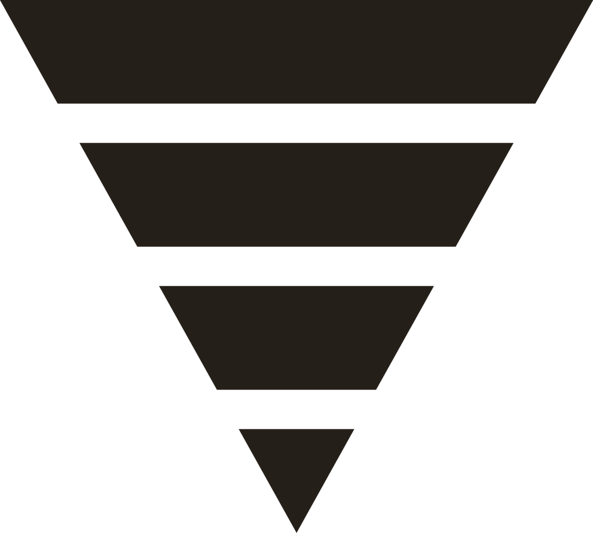
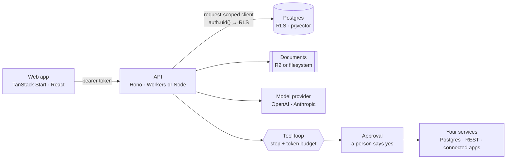

<div align="center">



# Covan

**One agent your team trains together.** Everyone talks to it privately —
isolated by row level security, not by a check in the API. It acts in your apps
too, and asks a person before the first call.

[](https://github.com/covan-ai/covan/actions/workflows/ci.yml)
[](LICENSE)
[](https://github.com/covan-ai/covan/releases)
[](https://covan.app/docs)

[Quick start](#quick-start) · [How it works](#how-it-works) · [What it does](#what-it-does) · [Documentation](#documentation) · [Self-hosting](docs/self-hosting.md) · [Contributing](#contributing-and-development) · [Licence](#licence)

</div>

Half a minute, uncut: start from a template, let the persona write itself from
the name, and the agent is live in a chat that belongs to you alone.

https://github.com/user-attachments/assets/6ac7bc61-2588-4949-918a-e66ccbc2db56

## Why Covan

Most team AI tools are built for engineers: a Slack bot, a sandbox, a deployment
pipeline. Covan is built for the rest of the company. Your team uploads what it
knows — process docs, contracts, research — and that becomes one agent's memory.
Everyone talks to that agent in their own private session, so the designer's
questions and the finance lead's questions never mix. What the agent knows is
shared; the conversations people have with it are not.

- **It is for** a five-person agency, a clinic, an ops or finance team: people
  who want a colleague who has read everything, not infrastructure to operate.
  One `docker compose up` and one API key, and the only interface is a web app.
- **It is not for** teams who want an agent harness. There is no CLI, no
  sandbox and no per-employee workspace to administer. If your team is mostly
  engineers, that other kind of tool is probably the one you want.

Every feature is in this repository. The open build ships a real
`unlimitedEntitlements` implementation — no licence key, no phone-home, no plan
tiers — so a self-hosted Covan is the whole product rather than a trial of it;
[what is never gated](#what-is-never-gated) says where the commercial line
actually falls.

Covan runs, and it was extracted from a working private product rather than
written as a demo. It is young as a project all the same: the API is unversioned
and nothing is promised about compatibility between commits. Read
[`docs/self-hosting.md`](docs/self-hosting.md) before you put it in front of
anyone outside your team.

## Quick start

No accounts, no cloud setup. You need Docker and an OpenAI API key.

```bash
git clone https://github.com/covan-ai/covan
cd covan
cp .env.docker.example .env     # set OPENAI_API_KEY
docker compose pull             # published images instead of a local build
docker compose up
```

Open <http://localhost:3000> and create an account — any email and password;
there is no mail server in the stack, so confirmation is off. Upload a document,
ask a question about it, and the reply carries a chip naming the file it came
from. That is the whole loop, and it is the thing to check first.

`docker compose pull` is worth the extra line: without it the first run compiles
the frontend on your machine, and with it both images come from
[`ghcr.io/covan-ai`](https://github.com/orgs/covan-ai/packages), prebuilt for
amd64 and arm64. Pin a release with `COVAN_VERSION=0.3.0` in `.env` — no leading
`v`, since the image tags are semver — or track the branch with
`COVAN_VERSION=edge`. Stop with `docker compose down`, and add `-v` to throw
away the database and the uploaded documents too.

**What a fresh stack does not have.** The acting half of Covan needs keys the
example file leaves empty: `COMPOSIO_API_KEY` for connected apps,
`RESEND_API_KEY` and `RESEND_FROM` for mail, and an OAuth app of your own for
Notion, Google Drive or Slack. Every row in [What it does](#what-it-does) says
what it needs. For a production deployment — Cloudflare Workers, Supabase and a
static host, or a single Docker host — see
[`docs/self-hosting.md`](docs/self-hosting.md).

## How it works


```mermaid
flowchart LR
  WEB["Web app<br/>TanStack Start · React"]
  API["API<br/>Hono · Workers or Node"]
  DB[("Postgres<br/>RLS · pgvector")]
  STORE[["Documents<br/>R2 or filesystem"]]
  LLM["Model provider<br/>OpenAI · Anthropic"]
  LOOP{{"Tool loop<br/>step + token budget"}}
  YES["Approval<br/>a person says yes"]
  SVC["Your services<br/>Postgres · REST · connected apps"]

  WEB -->|"bearer token"| API
  API -->|"request-scoped client<br/>auth.uid() → RLS"| DB
  API --> STORE
  API --> LLM
  API --> LOOP
  LOOP --> YES
  YES --> SVC
```

**Authorization lives in Postgres, not in the API.** A request arrives carrying
the caller's token. The API does not unpack it, decide what that person may see
and write a filter — it hands the token to a request-scoped client and asks
Postgres for the rows. A route that forgets to scope a query by workspace is an
ordinary bug in most systems and a data leak in all of them; here it is only the
first of those. A row you cannot see is absent rather than forbidden, so
fetching another member's agent by id returns 404: the select matched nothing.

**The tool loop is bounded before it starts.** The model streams, asks for a
tool, is given the result, and streams again — under a step ceiling and a token
budget it cannot talk its way past (eight steps on the open build), a cap on how
much of any single result it is shown, and a timeout per tool. Every id a tool
touches is resolved from the session rather than taken from the model, every
tool reads through the caller's own client so RLS decides there too, and every
call is written down under the reply that made it, arguments included, and
travels in your export.

**Three guards, deliberately overlapping**: a one-second static check that no
table ships without row level security, a suite that runs the policies against a
real Postgres with real users and real tokens (`tests/rls/`), and a pinned
allowlist for the service-role key. Nothing happens at a connected app until
somebody reads the operation and says yes, and an operation that changes data
there asks for itself every time, however many approvals the conversation has
already collected. The exception is an HTTP service you deliberately opened to
write methods: there the bound is the origin and the method list you set, not a
card. Secrets are encrypted before they reach the database, and the one API
route a browser touches without a token is the logo proxy — allow-listed to two
Composio hosts and cached a week, so a grid of tiles does not hand a third party
the address of everyone who opens the page. [`docs/security.md`](docs/security.md)
is the long version; report anything you find through
[`SECURITY.md`](SECURITY.md), privately, and never as a public issue.

The stack: React 19 and TanStack Start in `src/`, Hono in `worker/` on either
Cloudflare Workers or Node 22, Postgres with `pgvector`, R2 or the filesystem
for documents, Tailwind 4, built with Bun and Vite. One source serves both
runtimes and the discriminator is whether the R2 binding is present — there is
no mode flag, because a mode flag is a thing that can disagree with reality.

## What it does

### Ask

| What you get                        | How                                                                                     | Needs                |
| ----------------------------------- | --------------------------------------------------------------------------------------- | -------------------- |
| Answers that name their source      | `pgvector` for meaning with a similarity floor, plus a Postgres full-text arm for codes | —                    |
| Citations that survive a reload     | the grounding documents are written onto the message, by id and by name                 | —                    |
| A private session for each person   | sessions are private by default, enforced by policy rather than by a filter             | —                    |
| Dictation in the composer           | Whisper, up to about two minutes a clip                                                 | —                    |
| A question you can edit and re-ask  | the answer is versioned, so the old one is still there                                  | —                    |
| Ask from Slack                      | a channel or a DM reaches the same agent, with the same grounding                       | a Slack app of yours |
| Search across the messages you have | Postgres full-text, scoped by what your role can read                                   | —                    |


Every figure in that answer is in the uploaded document, and the chip under it
says which one. That is the whole difference between this and a chat window: not
that it answers, but that you can check it. The similarity floor is what makes a
wrong answer less likely than a coy one — vector search always returns
something, so without a floor a question about somebody's holiday plans still
drags in the nearest paragraph of the deployment runbook.

### Know

| What you get                    | How                                                                                   | Needs                 |
| ------------------------------- | ------------------------------------------------------------------------------------- | --------------------- |
| Knowledge bundles               | group documents by subject, then attach or detach a bundle per agent                  | —                     |
| Uploads                         | `md`, `txt`, `csv`, `json`, `pdf`; PDF text is extracted in your browser              | —                     |
| Reports the agent writes        | `/report write up the quarter for the board`, landing as a document of its own        | —                     |
| Sources that stay in sync       | a Notion database or a Drive folder, reconciled — additions, edits and withdrawals    | an OAuth app of yours |
| Templates and the revisit panel | example documents for a team that has written nothing down; files old enough to doubt | —                     |

There is no OCR, and that is a decision rather than a gap: a scanned PDF with no
text layer is refused at indexing instead of landing as a document that looks
searchable and answers nothing. A report goes into a bundle named after the
agent, separate from the files you uploaded, so you can detach what the agent
produced without detaching your own sources.

### Act

| What the agent can do                             | What bounds it                                                                                | Needs                          |
| ------------------------------------------------- | --------------------------------------------------------------------------------------------- | ------------------------------ |
| Search your documents while it is answering       | the bundles attached to that agent, and the similarity floor                                  | —                              |
| Read a connected Postgres, writing its own SQL    | `set local transaction read only`, inside a function you install on that database             | a service                      |
| Call a REST API you hold a token for              | one origin, the methods you allowed, and a path it names — never a URL                        | a service                      |
| Find an operation across about 1,500 applications | search only; it runs nothing                                                                  | `COMPOSIO_API_KEY`             |
| Run one operation at a connected app              | a person approves the first call per app in a turn, and anything that changes data asks again | `COMPOSIO_API_KEY`             |
| Mail you a result, or propose a routine for it    | it names one of your own delivery channels, never an address; both wait for a yes             | `RESEND_API_KEY`, or a channel |

Eight files in `worker/src/lib/harness/tools/`, and `harness/registry.ts` is the
whole list — there is no per-service code and there is not meant to be, because
a service is a row telling a general tool where to go. Connected apps come from
**Composio**, which describes about 1,500 services and keeps a registered
application for the common ones: 1,437 of 1,596 were connectable on 2026-10-05,
123 of them by signing in at the application and most of the rest by pasting a
key on a page Composio hosts. Covan never sees that credential; it stores a
reference to one. The call is still made here, under the same budget, the same
allowance and the same approval as everything else — and a standing
"always allow" is an admin's decision, per agent, per app, per operation, which
any writer can take back.

### Run unattended

| What you get       | How                                                                                | Needs                      |
| ------------------ | ---------------------------------------------------------------------------------- | -------------------------- |
| What starts it     | a cron schedule in your timezone, or a webhook URL you paste into GitHub or `curl` | —                          |
| What it watches    | an RSS feed, a web page by content hash, a bundle a connection syncs, or nothing   | —                          |
| Where it lands     | email, a Slack webhook, or a signed webhook of yours                               | `RESEND_API_KEY` for email |
| What it keeps      | each result optionally filed into a bundle, with a retention you set               | —                          |
| What it may not do | anything needing approval: it records what it wanted and says so in the message    | —                          |

A run has nobody to ask. So a scheduled routine gets the same tools and the same
step ceiling as a chat, and an action that would have shown somebody a card is
reported as wanted and not done rather than taken quietly. It can also decline
to send at all, which is what separates a useful digest from a daily email
nobody opens.

### Work as a team

| What you get                            | How                                                                                                | Needs                        |
| --------------------------------------- | -------------------------------------------------------------------------------------------------- | ---------------------------- |
| Shared sessions and brainstorm boards   | bring the team into one conversation, or an idea board with stages                                 | —                            |
| Roles                                   | owner, admin, member, viewer — a SQL predicate, not a disabled button                              | —                            |
| An activity log                         | who did what in the workspace, paginated                                                           | —                            |
| A coverage report                       | how answers were grounded, by agent and bucket — never a person, never a question                  | admin                        |
| Recoverable deletion                    | an agent, a bundle or a document comes back for thirty days; the audit row is written by a trigger | —                            |
| Usage priced by the model that answered | per reply, rather than by whatever the agent is set to today                                       | —                            |
| Your own provider key                   | a workspace key for OpenAI or Anthropic, covering completions                                      | `PROVIDER_KEY_SECRET`, admin |
| API keys                                | hashed with SHA-256 and shown once; a key acts as its owner                                        | `SUPABASE_JWT_SECRET`        |
| Take it with you                        | one archive — agents, documents and their files, chats, routines — plus SQL to replay it           | —                            |

"Nothing is held hostage" should be checkable by the team rather than only by
whoever runs the server, which is why the export is a button in Settings and not
a `pg_dump` ([`docs/export.md`](docs/export.md)). It is read through the
caller's own client, so an admin's archive and a member's archive are different
files, and the manifest says so.

### Models and endpoints

| What you get           | Detail                                                                                           |
| ---------------------- | ------------------------------------------------------------------------------------------------ |
| OpenAI, out of the box | GPT-4o, GPT-4o mini, GPT-4.1, GPT-4.1 mini, GPT-5, GPT-5 mini, GPT-5 nano                        |
| Claude, opt in         | Opus 5, Sonnet 5, Opus 4.8, Sonnet 4.6, Sonnet 4.5, Haiku 4.5 — with `ANTHROPIC_API_KEY`         |
| Per agent              | model, temperature, how hard a reasoning model thinks, brainstorm mode, and web search on Claude |
| Your own endpoint      | `OPENAI_BASE_URL` for completions, `EMBEDDING_BASE_URL` for documents                            |

Leave `ANTHROPIC_API_KEY` unset and nothing reaches Anthropic: those models are
not offered, not accepted and not resolved. The two base URLs are separate
variables on purpose — embedding is where the whole text of every file is sent,
and moving it also means moving the width of the vector column
([`docs/self-hosting.md`](docs/self-hosting.md) walks through both). Audio
transcription is the one thing that stays at OpenAI; hardly any compatible
server implements it.

## Documentation

The same pages are rendered at <https://covan.app/docs> if you would rather read
them there.

| Page                                   | What it answers                                                                 |
| -------------------------------------- | ------------------------------------------------------------------------------- |
| [Quickstart](docs/quickstart.md)       | From an empty account to an answer that names the file it came from             |
| [Core concepts](docs/concepts.md)      | Workspace, agent, bundle, session, routine — what each is and how they nest     |
| [Knowledge bundles](docs/knowledge.md) | Uploading, grouping, attaching, and why a question finds the passage it does    |
| [Routines](docs/routines.md)           | Scheduled work, what it can reach, and what it does with the secret you give it |
| [Integrations](docs/integrations.md)   | Synced sources, the services an agent can call, connected apps and approvals    |
| [Your team](docs/team.md)              | Invitations, what a role actually gates, shared sessions, deletion              |
| [The API](docs/api.md)                 | Reaching Covan from a script or another service, and what a key can do          |
| [Taking it with you](docs/export.md)   | Exporting a workspace, and putting it back into a Covan you run                 |
| [Self-hosting](docs/self-hosting.md)   | Running it on your own machine, and deploying it somewhere real                 |
| [Architecture](docs/architecture.md)   | How a request reaches a row, and the two seams that serve both runtimes         |
| [Security](docs/security.md)           | Where authorization lives, what a secret is at rest, and what self-hosting owes |

## Contributing and development

Read [`CONTRIBUTING.md`](CONTRIBUTING.md) first — it includes a contributor
license agreement, and that agreement grants an **exclusive** copyright licence
to the maintainer, with a grant-back so you keep using your own work. It is what
made the move from AGPL-3.0 to FSL-1.1-ALv2 possible without tracking down every
contributor, and it is unusual enough to read before you open a pull request.

Node 22 or newer, and [Bun](https://bun.com). Node 22 is a floor rather than a
preference: `@supabase/supabase-js` needs a global `WebSocket` and the frontend
imports it during server-side rendering, so on Node 20 every server-rendered
page returns an error while the build stays green.

```bash
bun install && (cd worker && bun install)
cp .env.example .env
cp worker/.dev.vars.example worker/.dev.vars

bun run dev            # vite dev server, from the root
bun run test           # and bun run lint, bun run typecheck
cd worker && bun run dev   # wrangler dev; bun run test, typecheck, dry
```

`bun run dev` still needs backing services: `docker compose up db auth rest realtime kong migrate`
and point `.env` and `worker/.dev.vars` at `http://localhost:8000`. Because
authorization lives in the database, the policies have a suite of their own —
`bun run test:rls` drives a real Postgres with real tokens, and
`bun run check:rls` is the one-second guard that catches a new table nobody
enabled row level security on. `CONTRIBUTING.md` has the variables both need.

| Path                   | What it is                                                 |
| ---------------------- | ---------------------------------------------------------- |
| `src/`                 | TanStack Start frontend — file-based routes, shadcn/ui     |
| `worker/`              | Hono API; `src/index.ts` is the Worker, `src/node.ts` Node |
| `supabase/migrations/` | Numbered SQL, applied in order                             |
| `tests/rls/`           | Policy tests, driven against a real Postgres, not read     |
| `docker/`              | Compose support files (Kong config, DB init hooks)         |
| `docs/`                | The documentation above, in markdown                       |

`AGENTS.md` is the short version of the rules that matter here, and `DESIGN.md`
is the binding visual contract for new UI. Behaviour expectations are in
[`CODE_OF_CONDUCT.md`](CODE_OF_CONDUCT.md).

**Getting help.** Bugs and questions belong in
[issues](https://github.com/covan-ai/covan/issues) — there is a template for
each. Vulnerabilities go to `efe@covan.app` through
[`SECURITY.md`](SECURITY.md), never to an issue. Anything else, including
commercial licensing, is the same address.

## Roadmap

No dates and no order; [the issue list](https://github.com/covan-ai/covan/issues)
is the real one.

- An onboarding template, so a team's first day is not a blank workspace.
- Watching a folder, instead of asking people to build a connector catalogue.
- Our own web search tool, so it works on every model rather than Claude's.
- The applications that still need somebody to register them in Composio's
  dashboard before a team can connect them — 159 of 1,596 as things stand.
- Routines that can write back into Covan, not only out to Slack or email.

## What is never gated

Agents, retrieval over your own documents, the tool loop and every tool in it,
connected apps, routines, chat, workspaces, sharing, roles, the activity log and
the full data export are all in this repository, with no feature flags, no plan
tiers and no licence keys. The quota interface the hosted product needs is here
too, and the open build satisfies it with `unlimitedEntitlements` — a real
implementation rather than a stub that throws, so nothing phones home and
nothing counts. Nothing that works today will move behind a paywall later.

There is a hosted Covan, and what it sells is not features: it is somebody else
running the database, the backups and the upgrades. If paid capabilities do
appear, the one genuinely missing from this tree is SAML single sign-on, and
alongside it the operational things a service can offer and a repository cannot:
hosting, support, an SLA, a signed data-processing agreement.

## Licence

Copyright 2026 Mahmut Efe Dara.

[FSL-1.1-ALv2](LICENSE) — the Functional Source License, with Apache 2.0 as the
future license. In plain terms:

- **You may** run Covan for your own team, free, commercially, for as many
  people as you like; read it, change it, keep your changes; build on it; and
  provide paid professional services to another Covan licensee.
- **You may not** offer Covan to others as a commercial product or service that
  substitutes for Covan — that is, resell it as hosting.
- **After two years** each version is additionally available to you under the
  Apache License 2.0, and that grant is irrevocable.

The [LICENSE](LICENSE) file is the authority and it is the FSL template
verbatim, with only the copyright notice filled in. This summary loses to it
wherever the two differ. The software is provided as is, without warranty of any
kind. Versions up to and including v0.2.0 shipped under AGPL-3.0-only and stay
that way, irrevocably.

This is a source-available licence rather than an open-source one: the OSI has
not approved the FSL, so calling Covan open source would be inaccurate. Want to
host Covan for other people? That is what a commercial licence is for — write to
efe@covan.app.
