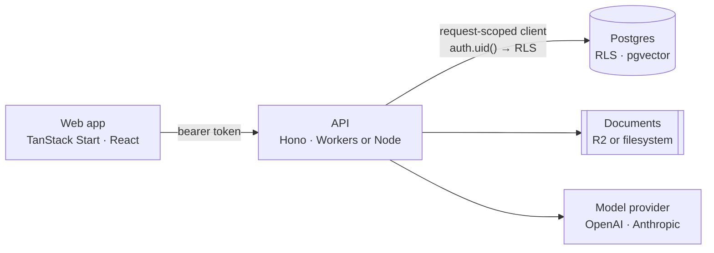

# Covan

A shared AI agent for your team. Everyone trains it together; everyone talks to
it privately.

Half a minute, uncut: start from a template, let the persona write itself from
the name, and the agent is live in a chat that belongs to you alone.

https://github.com/user-attachments/assets/6ac7bc61-2588-4949-918a-e66ccbc2db56

## What is Covan?

Most team AI tools are built for engineers: a Slack bot, a sandbox, a
deployment pipeline. Covan is built for the rest of the company.

Your team uploads what it knows — process docs, contracts, research — and that
becomes one agent's memory. Everyone talks to that agent in their own private
session, so the designer's questions and the finance lead's questions never mix.

Give it a persona ("you are our senior product manager") and it answers like
one.

## Features

- **Shared brain, private rooms.** One agent, trained collectively; every
  conversation isolated per person by Postgres row level security, not by a
  check in the API.
- **Knowledge bundles.** Group documents by subject and attach or detach them
  from an agent, instead of one undifferentiated pile.
- **Grounded answers.** Retrieval over your documents on two arms: `pgvector`
  for meaning, with a similarity floor so an off-topic question doesn't drag in
  the nearest irrelevant passage, and a Postgres full-text arm for the verbatim
  strings an embedding is nearly blind to — a contract number, an acronym, an
  error code. The documents that grounded a reply are stored with it, so
  citations survive a reload.
- **Reports the agent writes.** Say what a write-up should cover — from the chat
  composer, or `/report write up the quarter for the board` — and it is written
  against the conversation and the bundles attached to it. What comes back is an
  ordinary markdown document that downloads, moves and exports like an upload,
  in a bundle of its own so what the agent produced stays separable from the
  sources it was given.
- **Sources that stay in sync.** Point a bundle at a Notion database or a
  Google Drive folder and it reconciles on a schedule — additions, edits and
  withdrawals — instead of leaving somebody to re-upload; and an agent can be
  asked from Slack without opening the web app. Each of the three is an OAuth
  app you register once ([`docs/integrations.md`](docs/integrations.md)).
- **Services and apps it can call.** An agent can also go and look while it is
  answering: a Postgres, read-only by the transaction rather than by trust; any
  REST API you hold a token for; and, with `COMPOSIO_API_KEY`, the roughly 1,500
  applications Composio describes — Gmail, Slack, Linear among them — connected
  by signing in at the application, or on a page Composio hosts for the ones
  that want a key of their own, rather than by a form here. The first
  time an agent acts on one in a conversation you are shown the operation and
  every argument and it waits for a yes; anything that changes data at the far
  end asks again, every time.
- **Routines.** Scheduled work that runs while nobody is watching: point one at
  an RSS feed, a web page or a synced bundle, say what to do with what is new,
  and get the result by email or Slack.
- **Collaborative sessions.** Bring the team into one conversation, or one
  brainstorm board, when the question is shared.
- **Take it with you.** One button in Settings downloads the whole workspace
  as an archive — agents, documents and their files, chats, routines — with
  the SQL to replay it into a Covan you run yourself. "Nothing is held
  hostage" should be checkable by the team, not only by whoever runs the
  server ([`docs/export.md`](docs/export.md)).
- **Pick the model per agent.** OpenAI's GPT-4o, GPT-4.1 and GPT-5 families
  out of the box; add `ANTHROPIC_API_KEY` and Claude Opus 5, Sonnet 5, Opus 4.8,
  Sonnet 4.6, Sonnet 4.5 and Haiku 4.5 join the picker. Leave that key unset and
  nothing reaches Anthropic — the models are not offered, not accepted, and not
  resolved. Temperature and, where the model has one, how hard it thinks before
  it answers are per agent too.
- **Bring your own endpoint.** Set `OPENAI_BASE_URL` and completions go to
  Ollama, vLLM, LiteLLM or OpenRouter instead of OpenAI. Set
  `EMBEDDING_BASE_URL` and your documents go there too — a separate variable,
  because embedding is where the whole text of every file is sent and moving it
  also means moving the width of the vector column
  ([`docs/self-hosting.md`](docs/self-hosting.md) walks through both). Audio
  transcription is the one thing that stays: hardly any compatible server
  implements it.
- **Two runtimes, one source.** The same code runs on Cloudflare Workers with R2
  in production and on Node with the filesystem under `docker compose`.


Every figure in that answer is in the uploaded document, and the chip under it
says which one. That is the whole difference between this and a chat window: not
that it answers, but that you can check it.

## Status

Covan runs, and it was extracted from a working private product rather than
written as a demo. It is nonetheless young as an open-source project: the API is
unversioned and nothing is promised about compatibility between commits. Read
[`docs/self-hosting.md`](docs/self-hosting.md) before you put it in front of
anyone outside your team.

## Quick start

No accounts, no cloud setup. You need Docker and an OpenAI API key.

```bash
git clone https://github.com/covan-ai/covan
cd covan
cp .env.docker.example .env     # set OPENAI_API_KEY
docker compose pull             # optional: published images instead of a build
docker compose up
```

Then open <http://localhost:3000> and create an account — any email and
password; there is no mail server in the stack, so confirmation is off.

`docker compose pull` is worth the extra line. Without it the first run compiles
the frontend on your machine, which is a few minutes; with it, both Covan images
come from
[`ghcr.io/covan-ai`](https://github.com/orgs/covan-ai/packages) prebuilt for
amd64 and arm64. Either way the stack pulls half a dozen supporting images —
Postgres, GoTrue, PostgREST, Kong — so give the first start a minute.

Pin a release with `COVAN_VERSION=0.3.0` in `.env` — no leading `v`, since the
image tags are semver — or track the branch with `COVAN_VERSION=edge`. The
default is `latest`, which follows releases.

Stop with `docker compose down`; add `-v` to throw away the database and the
uploaded documents too.

For a production deployment — Cloudflare Workers, Supabase and Vercel, or a
single Docker host — see [`docs/self-hosting.md`](docs/self-hosting.md).

## Architecture


```mermaid
flowchart LR
  WEB["Web app<br/>TanStack Start · React"]
  API["API<br/>Hono · Workers or Node"]
  DB[("Postgres<br/>RLS · pgvector")]
  STORE[["Documents<br/>R2 or filesystem"]]
  LLM["Model provider<br/>OpenAI · Anthropic"]

  WEB -->|"bearer token"| API
  API -->|"request-scoped client<br/>auth.uid() → RLS"| DB
  API --> STORE
  API --> LLM
```

Authorization lives in Postgres, not in the API. Each request carries the
caller's token into a request-scoped Supabase client, so row level security
decides what that user can see. The API cannot accidentally widen access by
forgetting a `where` clause.

Storage and scheduling sit behind interfaces, so the same source runs on
Cloudflare Workers with R2 in production and on Node with the filesystem in the
Docker stack.

See [`docs/architecture.md`](docs/architecture.md) for detail.

## Documentation

`docs/` is the whole of it. The same files are rendered at
<https://covan.app/docs> if you would rather read them there.

| Page                                   | What it answers                                                                 |
| -------------------------------------- | ------------------------------------------------------------------------------- |
| [Quickstart](docs/quickstart.md)       | From an empty account to an answer that names the file it came from             |
| [Core concepts](docs/concepts.md)      | Workspace, agent, bundle, session, routine — what each is and how they nest     |
| [Knowledge bundles](docs/knowledge.md) | Uploading, grouping, attaching, and why a question finds the passage it does    |
| [Routines](docs/routines.md)           | Scheduled work, what it can reach, and what it does with the secret you give it |
| [Integrations](docs/integrations.md)   | Syncing a bundle from Notion or Drive, and asking an agent from Slack           |
| [Your team](docs/team.md)              | Invitations, what a role actually gates, shared sessions, deletion              |
| [The API](docs/api.md)                 | Reaching Covan from a script or another service, and what a key can do          |
| [Taking it with you](docs/export.md)   | Exporting a workspace, and putting it back into a Covan you run                 |
| [Self-hosting](docs/self-hosting.md)   | Running it on your own machine, and deploying it somewhere real                 |
| [Architecture](docs/architecture.md)   | How a request reaches a row, and the two seams that serve both runtimes         |
| [Security](docs/security.md)           | Where authorization lives, what a secret is at rest, and what self-hosting owes |

## Repository layout

| Path                   | What it is                                                 |
| ---------------------- | ---------------------------------------------------------- |
| `src/`                 | TanStack Start frontend — file-based routes, shadcn/ui     |
| `worker/`              | Hono API; `src/index.ts` is the Worker, `src/node.ts` Node |
| `supabase/migrations/` | Numbered SQL, applied in order                             |
| `tests/rls/`           | Policy tests, driven against a real Postgres, not read     |
| `docker/`              | Compose support files (Kong config, DB init hooks)         |
| `docs/`                | The documentation above, in markdown                       |

## Development

Node 22 or newer, and [Bun](https://bun.com). Node 22 is a floor, not a
preference: `@supabase/supabase-js` builds a realtime client that needs a global
`WebSocket`, which arrived in Node 22, and the frontend imports it during
server-side rendering — so on Node 20 every server-rendered page returns an
error shell while the build stays green.

```bash
bun install
cd worker && bun install && cd ..

cp .env.example .env
cp worker/.dev.vars.example worker/.dev.vars
```

Frontend, from the repo root:

```bash
bun run dev            # vite dev server
bun run test
bun run lint
```

API, from `worker/`:

```bash
bun run dev            # wrangler dev
bun run test
bun run typecheck
bun run dry            # wrangler deploy --dry-run
```

You still need backing services for `bun run dev`. The simplest way to get them
is `docker compose up db auth rest realtime kong migrate` and point `.env` and
`worker/.dev.vars` at `http://localhost:8000`.

Because authorization lives in the database, the policies have a suite of their
own: `bun run test:rls` drives a real Postgres with real users and real tokens,
and `bun run check:rls` is the second-long static guard that catches a new table
nobody enabled row level security on. The suite needs the stack above and a
handful of variables pointed at it — [`CONTRIBUTING.md`](CONTRIBUTING.md) spells
them out, and they are the same ones CI uses.

`AGENTS.md` is the short version of the rules that matter here; `DESIGN.md` is
the binding visual contract for new UI.

## Contributing

See [`CONTRIBUTING.md`](CONTRIBUTING.md) — it includes the contributor license
agreement. Report vulnerabilities privately: [`SECURITY.md`](SECURITY.md), not a
public issue. Behaviour expectations are in
[`CODE_OF_CONDUCT.md`](CODE_OF_CONDUCT.md).

## What is never gated

Every feature is in this repository. Agents, retrieval over your own documents,
routines, chat, workspaces, sharing, roles, the audit log and the full data
export are all here, with no feature flags, no plan tiers and no licence keys —
a self-hosted Covan is the whole thing, not a trial of it. Nothing that works
today will move behind a paywall later.

There is a hosted Covan, and what it sells is not features: it is somebody else
running the database, the backups and the upgrades. If paid capabilities do
appear, the one genuinely missing from this tree is SAML single sign-on, and
alongside it the operational things a service can offer and a repository cannot:
hosting, support, an SLA, a signed data-processing agreement.

## License

Copyright 2026 Mahmut Efe Dara.

[FSL-1.1-ALv2](LICENSE) — the Functional Source License, with Apache 2.0 as the
future license. In plain terms:

- **You may** run Covan for your own team, free, commercially, for as many people
  as you like; read it, change it, keep your changes; build on it; and provide
  paid professional services to another Covan licensee.
- **You may not** offer Covan to others as a commercial product or service that
  substitutes for Covan — that is, resell it as hosting.
- **After two years** each version is additionally available to you under the
  Apache License 2.0, and that grant is irrevocable.

The [LICENSE](LICENSE) file is the authority and it is the FSL template verbatim,
with only the copyright notice filled in. This summary loses to it wherever the
two differ. The software is provided as is, without warranty of any kind.

This is a source-available licence rather than an open-source one: the OSI has
not approved the FSL, so calling Covan open source would be inaccurate. Want to
host Covan for other people? That is what a commercial licence is for — write to
efe@covan.app.
