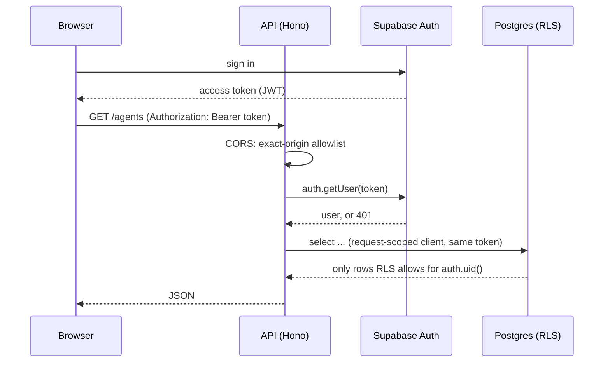

# Covan architecture

How a request gets from a browser to a row in Postgres, why authorization lives
in the database rather than in the API, how retrieval and routines work, and the
two seams that let one codebase run on two runtimes.

If you only read one section, read [Authorization](#authorization-is-postgres).

## The pieces

| Piece            | What it is                                                             |
| ---------------- | ---------------------------------------------------------------------- |
| Web app          | TanStack Start (React 19, Vite, Tailwind v4, shadcn/ui), `src/`         |
| API              | Hono, `worker/src/` — one app, two entry points                        |
| Database         | Postgres with `pgvector`, behind Supabase Auth + PostgREST             |
| Document storage | Cloudflare R2, or a directory on disk                                  |
| Model            | OpenAI — chat completions and `text-embedding-3-small`                 |

The API has two entry points over the same Hono app:
`worker/src/index.ts` exports `fetch` (and a `scheduled` handler) for Cloudflare
Workers; `worker/src/node.ts` serves the same app with `@hono/node-server` and
runs the routine engine on a `setInterval`. There is no second implementation —
see [The two seams](#the-two-seams).

## The request path



1. The browser holds a Supabase session. Sign-in, sign-up and password reset go
   straight to Supabase Auth; the API is not involved.
2. Every API call carries `Authorization: Bearer <access token>`.
3. CORS runs first (`worker/src/index.ts`). Allowed origins are the exact
   strings in `ALLOWED_ORIGIN`, comma-separated, plus `http://localhost:*` for
   development. There is deliberately no pattern matching — see
   [`docs/self-hosting.md`](self-hosting.md#two-traps-worth-knowing-about).
4. `authMiddleware` (`worker/src/middleware/auth.ts`) validates the token with
   an anon-key client (`authClient`), then puts two things on the context:
   `user`, and `db` — a **request-scoped** Supabase client constructed with the
   anon key and the caller's token forwarded as an `Authorization` header.
5. Routes read and write through `c.get("db")` — with the deliberate exceptions
   listed [below](#when-the-service-role-client-is-legitimate).

That fifth step is the whole design. The client carrying the caller's token
means `auth.uid()` inside Postgres resolves to that user, so every policy in
`supabase/migrations/` applies to every query a route makes — without the route
knowing anything about it.

## Authorization is Postgres

Row level security is the security boundary. Not a middleware, not a helper, not
a convention about remembering a `where` clause.

Concretely:

- Policies are defined in the numbered migrations and are the only thing
  standing between two users' data. A route that forgets to filter by owner
  still returns nothing it shouldn't, because the database filtered it.
- A row you cannot see is **absent**, not forbidden. Fetching another user's
  agent by id returns 404, because the `select` matched zero rows — there is no
  ownership check in the route to return 403 from.
- RLS is row-level and cannot hide a *column*. Where a column must stay
  invisible, column grants do it: `delivery_channels` has the blanket
  `authenticated` grant revoked and every column except `secret_ciphertext`
  handed back (`0012_routines.sql`). A user can list their own delivery
  channels; the encrypted secret is not among the columns they can select.
- A policy constrains the columns it names and nothing else, and the gap is
  invisible until someone writes the column it forgot.
  `messages_insert_user_self` (`0009_lock_assistant_messages.sql`) required an
  inserted message to carry the caller's own id as `sender_id` and to belong to
  a session that caller can read — and stopped there. It did not inspect `role`,
  and nothing behind it did either: no trigger on `messages`, no revoke, so
  `authenticated` kept its PostgREST `INSERT`. A member could write
  `role = 'assistant'` with their own `sender_id` into any session they could
  see, and every other member's client, which branches on `role` alone, rendered
  it under the agent's name. `0018_message_authorship.sql` adds `and role =
  'user'` to the check. The server is unaffected, because it writes assistant
  rows through the service-role client, which no policy reaches.
- `SECURITY DEFINER` functions need their `EXECUTE` grant revoked from `PUBLIC`
  explicitly. Postgres grants it by default and every role inherits it, so
  `revoke ... from authenticated` alone leaves the function callable through
  PostgREST. `claim_due_routines` revokes from `public, anon, authenticated` and
  grants only to `service_role`.

Isolation was checked with two independent accounts, including a request to the
Data API (PostgREST) directly with the second user's JWT and no Covan code in
the path: agents, bundles, documents and routines belonging to the first user
were invisible, and a write attempt against a known id returned 404.

### When the service-role client is legitimate

`serviceClient()` bypasses RLS entirely, so every file allowed to call it is
pinned: `worker/src/service-client.static.test.ts` holds the allowlist, with the
argument for each entry written beside it, and fails on any call site that is not
on it. That test is the current list — the prose here is not, and a count in a
document goes stale in a way a failing test does not.

Three of those call sites are in the shared codebase, and each has a reason that
a request-scoped client cannot satisfy:

| Where                                | Why                                                                                                                              |
| ------------------------------------ | -------------------------------------------------------------------------------------------------------------------------------- |
| `routes/chat.ts` — persisting the assistant's reply | Assistant messages are written with no `sender_id`, and `messages_insert_user_self` (`0009_lock_assistant_messages.sql`) admits only rows stamped with the caller's own id. No client can write an unattributed row, so the server writes them under a role the policy does not reach. |
| `routes/routines.ts` — creating a delivery channel  | `INSERT` on `delivery_channels` is granted to nobody but the service role, on purpose: the destination secret has to be AES-GCM encrypted before it is written, and only the server can do that. |
| `lib/routines/dispatcher.ts` / `executor.ts`        | A cron tick has no caller and therefore no `auth.uid()`. There is no token to scope a client with. |

The hosted service adds one more, for its token meter: `user_usage` has a
select-own policy and no write policy at all, because a user who could write
their own counter could reset it. That call site sits behind the entitlements
interface (`worker/src/lib/entitlements/`), whose metered implementation only a
hosted build registers — the open build ships the unmetered one, which counts
nothing and never reaches for the service role.

The rule the codebase holds itself to: **a route that reaches for the
service-role client to make something work is almost always a bug.** In the two
route cases above, RLS is not being worked around — it is being *enforced*, and
the server is the only actor allowed through.

The routine executor pays for its service-role client with a rule of its own,
stated at the top of `executor.ts`: every id it uses is read off the routine row
it was handed, never taken as an argument. It also re-checks workspace
membership before doing anything, because removing someone from a workspace cuts
their RLS access instantly but would not otherwise stop a routine of theirs from
piping a workspace agent's output to a personal Slack forever.

## Retrieval

### Indexing, at upload

`POST /bundles/:id/documents/upload` (`worker/src/routes/bundles.ts`):

1. Size and extension are checked (10 MB cap). PDFs are extracted to text **in
   the browser** and the text posted alongside the file — `pdf.js` does not run
   reliably on the Workers runtime. Text formats are decoded server-side.
2. The bytes go to the document store under `<bundleId>/<uuid>-<safe filename>`.
   A failed store write needs no rollback here: no row exists yet.
3. A `documents` row is inserted, carrying an excerpt of the text. If the insert
   fails, the stored object is deleted — the one place a rollback is needed.
4. The text is chunked and embedded, **best-effort**. A failure here is logged
   and the document still exists; it is simply unindexed until reindexed.

Chunking (`lib/embeddings.ts`) is structure-aware and has no tokenizer
dependency: chunks are up to 1000 characters and break on the strongest natural
boundary available in the back half of the window — paragraph, then sentence,
then line, then word — with roughly 150 characters of overlap snapped back to a
word boundary. A hard cut happens only when there is no boundary at all, such as
one unbroken token.

Embeddings are `text-embedding-3-small`, 1536 dimensions, stored in
`document_chunks.embedding` as `vector(1536)` — all three by default rather than
by construction. `EMBEDDING_BASE_URL` and `EMBEDDING_MODEL` move them to any
OpenAI-compatible endpoint, and the column width follows via
`supabase/optional/embedding_width.sql`; `EMBEDDING_DIMENSIONS` is what keeps the
two in agreement, and `lib/embeddings.ts` refuses a vector that disagrees with it
rather than letting Postgres refuse the insert later. See
[self-hosting](self-hosting.md).

### Retrieval, at chat time

`worker/src/routes/chat.ts`:

1. Collect the bundles attached to the agent and the document *names* in them.
   Names alone, on the hot path — the stored full text is only needed by the
   fallback below, so it is loaded lazily there rather than on every turn.
2. Embed the latest user message and call `match_chunks(p_agent_id,
   p_query_embedding, p_match_count => 6, p_min_similarity => 0.25)`.
3. `match_chunks` (`0005_message_sources_and_match_threshold.sql`) is
   `SECURITY INVOKER`, so RLS on `document_chunks` and `documents` still applies.
   It computes `1 - (embedding <=> query)` as cosine similarity, keeps only rows
   at or above the floor, restricts to chunks whose bundle is attached to this
   agent, orders by distance and takes the top *n*.

   The floor is the interesting part. Without it, an off-topic question still
   returns the six nearest chunks — nearest is not the same as relevant — and
   those get injected into the prompt as though they were evidence. The SQL
   default is `0` for backward compatibility; the API passes `0.25`.
4. Matching chunks are assembled by `buildContextBlock` (`lib/rag.ts`) under a
   4000-character budget, in similarity order, and dropped once the budget is
   spent.
5. The block is sent as its own system message positioned *after* the prior
   turns and before the latest one — deliberately not merged into the persona
   prefix, so that prefix stays byte-identical across turns and OpenAI's
   automatic prompt caching can discount it.
6. The document names that grounded the reply are persisted to
   `messages.sources`, so citations survive a reload instead of being recomputed
   in the client.

There is a fallback: if nothing clears the floor but the agent does have
documents, the reply is grounded on the stored document text directly, newest
first, under the same budget. This exists for "summarise the file" style
questions, which embed close to nothing in particular and would otherwise get an
agent claiming it cannot read a file it plainly has.

Retrieval is best-effort throughout. Any failure — embedding, the RPC, the
fallback — falls back to a persona-only answer rather than failing the turn.

## Routines

A routine is: a source (an RSS feed, a web page, or nothing), an instruction, a
cron expression with a timezone, and a delivery channel (a Slack webhook or an
email address). The engine wakes up, asks the database what is due, and runs it.

### Claiming

```sql
update public.routines r
set claimed_at = now()
where r.id in (
  select id from public.routines
  where status = 'active'
    and next_run_at <= now()
    and (claimed_at is null or claimed_at < now() - p_stale_after)
  order by next_run_at
  for update skip locked
  limit p_limit
)
returning r.*;
```

`for update skip locked` is what makes overlapping ticks safe. Two ticks running
at once do not queue behind each other and do not collide: the second one steps
over every row the first has locked and takes the next ones instead. So the
engine can run as a Cloudflare cron trigger, as a `setInterval` in the Node
process, or as both at once, and no routine is ever claimed twice.

`claimed_at` is a lease, not a flag. A routine claimed more than
`p_stale_after` ago (15 minutes by default) is treated as abandoned — the
process that claimed it died mid-run — and becomes claimable again. Nothing is
lost when a worker is killed; the run is only late.

A tick claims at most 4 routines (`BATCH_SIZE` in `lib/routines/dispatcher.ts`).
That number is set by the Workers **Free** plan's 50-subrequest limit per
invocation, worked backwards from the worst case: 1 subrequest for the claim,
and up to 12 per routine. A backlog the tick cannot drain is left for the next
one rather than run until the invocation is killed.

### Running one

`lib/routines/executor.ts`, in order: check workspace membership → fetch the
source through the SSRF guard → diff the fetched items against the routine's
stored cursor → reserve the new item keys in `routine_deliveries` → summarise
with the model → deliver → record a `routine_runs` row and advance
`next_run_at`.

Two details worth knowing:

- **Delivery keys are reserved before the send, not after.** That is what makes
  a retry, an overlapping "run now", or a duplicated tick harmless: whoever gets
  there second reserves nothing and therefore delivers nothing.
- **The URL guard** (`lib/routines/url-guard.ts`) rejects loopback, RFC1918,
  link-local and IPv4-mapped-IPv6 addresses, on the original URL and on every
  redirect hop, plus any `workers.dev` host and the deployment's own hosts
  (`ALLOWED_ORIGIN`, and `WORKER_HOST` once a custom domain fronts the Worker)
  so a routine cannot be pointed back at Covan itself. It is explicit in its
  own header comment about what it does not do: it cannot resolve DNS, so a
  hostname that resolves to a private address still passes.

Failures back off, capped at six hours past the natural next run, and a routine
pauses itself after 5 consecutive failures — or 20 if they are transient (429s
and 5xx from the source), because backoff means twenty transient failures
represent days of an unreachable source, while three rate-limited ticks in an
afternoon represent nothing.

"Run now" (`runOneRoutine`) deliberately skips `claim_due_routines`: the point
is to run a routine that is *not* due, so there is nothing to claim.

## The two seams

Everything runtime-specific lives behind one of two interfaces. This is what
"two runtimes, one source" actually costs, and it is small.

**`worker/src/lib/docstore/`** — blob storage for uploaded documents.

```ts
interface DocStore {
  get(key: string): Promise<StoredObject | null>; // null when absent, never throws
  put(key: string, body: ArrayBuffer, opts: { contentType: string }): Promise<void>;
  delete(key: string): Promise<void>; // succeeds whether or not the key existed
}
```

`getDocStore(env)` picks the implementation by looking for `env.DOCS`, the R2
binding. Its presence is the runtime discriminator — there is no mode flag to
keep in sync, because a mode flag is a thing that can disagree with reality. No
binding means the filesystem store rooted at `DOCS_DIR`, which writes each
object plus a `.meta.json` sidecar holding the content type that R2 stores as
object metadata. Both implementations are held to one shared contract test.

**`worker/src/lib/defer.ts`** — work that outlives the response.

`deferred(c, promise)` calls `c.executionCtx.waitUntil` on Cloudflare, where the
isolate may otherwise be cancelled the moment the response is sent, and falls
back to a plain floating promise on Node, where accessing `c.executionCtx`
throws and no context is needed because the process outlives the request anyway.

**The rule: a route must never touch `env.DOCS` or `c.executionCtx` directly.**
Both compile fine and both pass a test suite. They fail in one runtime, in
production, at the moment a user uploads a file or sends a message.

## Data model, briefly

- `profiles`, `workspaces`, `workspace_members`, `invitations` — who is who. A
  signup trigger provisions a profile and a workspace for every new account.
- `agents` — name, emoji, persona, model, and `mode` (`normal` or `brainstorm`).
- `knowledge_bundles`, `documents`, `document_chunks`, `agent_bundles` — the
  knowledge side. Bundles attach to agents many-to-many, which is how one
  document can feed several agents and why detaching is instant.
- `chat_sessions`, `messages`, `ideas`, `favorites` — conversations. A session's
  `visibility` is `private` (the default) or `shared`, and the messages policies
  gate on the parent session's visibility rather than repeating the rule. The
  frontend subscribes to `postgres_changes` so shared sessions and idea boards
  update live.
- `routines`, `routine_runs`, `routine_deliveries`, `delivery_channels` — the
  scheduling side.

Migrations are numbered and applied in order, and an applied migration is never
edited — corrections go in a new file.
